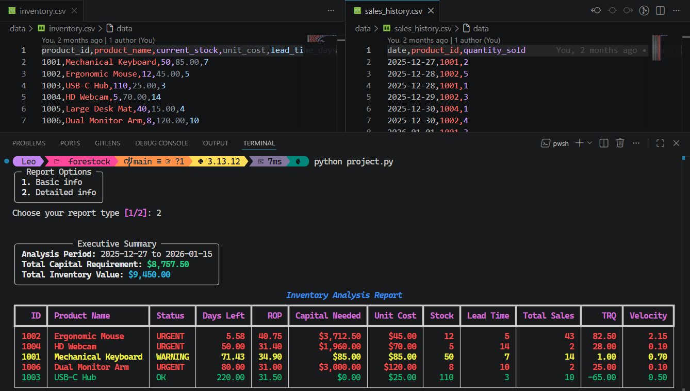

# ForeStock: Predictive Warehouse Analytics

**[Video Demo](https://www.youtube.com/watch?v=Y2Gl9fdZNb8)** • **[Final Project Certificate](https://cs50.harvard.edu/certificates/b48f3473-096e-4a47-99ec-6242c34cfca1)** ([PDF](https://certificates.cs50.io/b48f3473-096e-4a47-99ec-6242c34cfca1.pdf?size=A4) / [PNG](https://certificates.cs50.io/b48f3473-096e-4a47-99ec-6242c34cfca1.png?size=A4)) • **[Harvard CS50P Completion](https://submit.cs50.io/users/leo01102/cs50/problems/2022/python/project)**

#### Description:

ForeStock is a Command Line Interface (CLI) tool built for **Harvard University's CS50P** to solve **inventory distortion**, a common problem where businesses lose revenue due to stockouts or tie up capital in dead stock.

By leveraging historical sales data and supplier constraints, ForeStock converts a static inventory list into a **prioritized report**. It provides **warehouse managers** with a color-coded overview that automatically categorizes products as **URGENT** (immediate action needed), **WARNING** (order soon), or **OK** (safe levels).

### Forecasting Logic

The project implements five formulas to derive insights:

1. **Sales Velocity ($V$):** Calculates average units sold per day.
   > $$V = \frac{\sum \text{quantity sold}}{\text{days in history}}$$
2. **Days of Cover ($DC$):** How many days the current stock is expected to last.
   > $$DC = \frac{\text{current stock}}{V}$$
3. **Reorder Point ($ROP$):** The stock level that triggers a reorder so new items arrive before you run out.
   > $$ROP = (V \times \text{lead time}) + \text{safety stock}$$
4. **Target Reorder Quantity ($TRQ$):** How many units to buy to reach a desired stock level for a future period.
   > $$TRQ = (V \times \text{period supply}) + \text{safety stock} - \text{current stock}$$
5. **Capital Requirement ($CR$):** The total amount of money needed to buy the suggested items.
   > $$CR = \sum (TRQ \times \text{unit cost})$$

### Project Structure

- **`project.py`**: The main script that handles reading the CSV files, performing the inventory calculations, and sorting the final report. I placed the core math into standalone functions to make them easy to verify with `pytest`.
- **`models.py`**: Defines the `Product` class used to organize item data. It includes a helper method to create objects _from rows_ and logic to format these rows for the terminal display.
- **`test_project.py`**: Collection of tests to ensure that the sales velocity, date ranges, and sorting logic work as expected.
- **`data/`**: Folder containing the CSV files used for current inventory levels and past sales records.

### Design Decisions & Challenges

- **Polars vs Pandas:** I chose the **Polars** library for data manipulation. It is a modern, fast alternative to Pandas that makes it easy to join different CSV files together and perform calculations across entire columns at once.
- **Handling Zero Sales:** A major part of the logic was managing products with no recent sales history. Usually, this would cause an error (division by zero) when calculating how many days of stock are left. I used "null" values to handle these cases, allowing the program to label them as "N/A" and move them to the bottom of the priority list
- **Functions and Classes:** I used a mix of standalone functions and a `Product` class. I kept the mathematical formulas in functions to make them easier to verify with tests, while the class was used to organize product data and manage how it is formatted for the final table display.

### Installation & Usage

1. Install dependencies: `pip install -r requirements.txt`
2. Run the application: `python project.py`
3. Select "Basic" for a summary or "Detailed" for a full supply-chain breakdown

### References

- **[Polars Documentation](https://docs.pola.rs/):** Used for fast, vectorized data manipulation and analysis.
- **[Rich Documentation](https://rich.readthedocs.io/):** Used to create the color-coded terminal UI and dynamic tables.
- **[Inventory Formulas](formulas.md):** Detailed explanations of the mathematical logic and business intuition used for reordering and optimization
